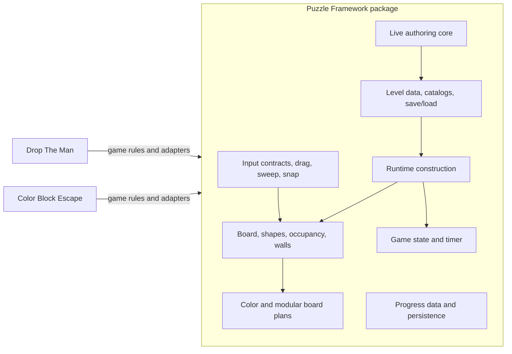

# Puzzle Framework

Puzzle Framework is a reusable Unity package for grid-based puzzle games. I build playable
prototypes first, then promote mechanics into the package only after a second game proves that the
same abstraction is useful. The repository contains the installable framework, its architectural
specifications, and a Unity validation project; it is not itself a standalone game.

## Key Features

- coordinate-based boards, explicit cell states, shape footprints, occupancy, and derived walls
- pointer projection, continuous drag requests, grid snapping, swept-footprint traversal, and
  collision/structure clearance queries
- collision-safe atomic footprint transfers for multi-cell moving entities
- JSON level save/load, Resources catalog discovery, duplicate validation, and opaque game payloads
- runtime construction validation and reusable runtime level contexts
- game-state transitions, countdown timers, player-progress data, and resilient JSON persistence
- shared color identities plus modular board visual planning and prefab construction
- a live level-authoring core with structural consequence reporting, placement, selection, move,
  rotation, erase, cell/edge picking, staged restore, and extensible game-owned tools

## Architecture Overview

| Area | Implemented responsibility |
| --- | --- |
| Board / Grid | Coordinates, cells, board bounds, shape footprints, occupancy, world layout, and wall derivation. |
| Interaction | Pointer projection, target contracts, dragging, snapping, swept traversal, and clearance queries. |
| Level Data / Loading | Generic level definitions, JSON persistence, Resources catalogs, and opaque game payload transport. |
| Runtime Construction | Build-safety validation and construction of reusable board, occupancy, flow, and timer contexts. |
| Runtime Flow | Explicit game-state transitions and countdown timer results. A broad shared event bus is documented but is not shipped package code. |
| Presentation | Stable color identities and data-driven modular board visual plans/builders. Game animation remains game-owned. |
| Progression | Versioned player progress plus local JSON save/load; each game owns unlock and campaign policy. |
| Editor Tooling | A live authoring session, cell/edge picking, structural consequence detection, and a small tool host used by both prototypes. |
| Resource Processing | Queue, buffer, and capacity systems have approved designs but are not currently implemented in the package. |

## Architecture Diagram



The framework owns reusable data and mechanics. Each prototype composes those services, decides
what a move means, and supplies concrete visuals and outcomes. This focused view explains the
important dependency direction without requiring readers to decode the full repository graph.

## Framework vs. Game-Specific Code

| Puzzle Framework owns | Game modules own |
| --- | --- |
| coordinates, board structure, footprints, occupancy, wall facts | cats, holes, blocks, exits, and their gameplay meaning |
| generic drag/sweep/snap and clearance calculations | movement permission, collection, exit admission, and scoring rules |
| level envelope, schema persistence, catalogs, and construction contracts | opaque payload interpretation and game-specific construction |
| game-state and timer lifecycle | win/loss policy and exact outcome precedence |
| color identities and modular board planning | materials, animation, effects, prefabs, and UI |
| generic authoring session, picking, placement, move, rotation, and erase | palettes, entity tools, validation rules, and play-test policy |

Dependencies point from a game module to the framework. Framework assemblies do not reference
prototype assemblies or interpret prototype payloads.

## Reusable Systems Demonstrated

| Shared system | Drop The Man | Color Block Escape |
| --- | --- | --- |
| Board, footprints, occupancy | Tracks holes, cats, blocked cells, and capacity-bearing shapes. | Tracks irregular block footprints, structural cells, and progressive occupancy during exits. |
| Continuous movement | Moves a hole while applying DTM collection rules. | Moves fixed-orientation blocks with swept collision checks and no tunnelling. |
| Runtime flow | Coordinates level lifecycle, optional timer, progression, restart, and next level. | Resolves countdown loss and final-block acceptance, including win precedence at an exact timer tie. |
| Level data and construction | Loads catalogued JSON levels into cats, holes, board state, and prototype views. | Validates and constructs blocks, colored exits, timer data, and runtime occupancy. |
| Modular board presentation | Builds the configured DTM board surface and boundaries. | Reuses the same cell prefab and suppresses validated exit wall segments through a presentation-only override. |
| Authoring foundation | Uses center-anchored picking and preserves DTM's warned prune-on-resize policy. | Uses corner anchoring, rejects invalidating structural edits, and adds block/exit tools plus play-test handoff. |

## Level Creation / Editor Tooling

Both prototype editors run on the same live `LevelAuthoringCore`. Game-owned tools update the
shared board/placement session and their own opaque payload, serialize both into level JSON, then
use framework and game validation before runtime construction. The framework supplies resize,
picking, footprint fit, overlap checks, selection, move, rotation, erase, and save/load
coordination; DTM and CBE retain their own entities, HUDs, rules, and structural-edit policies.

## Technical Decisions

1. **Generalize after demonstrated reuse.** Shared editor and movement primitives were promoted
   only after both DTM and CBE needed them.
2. **Separate authored and runtime state.** JSON remains stable while construction creates mutable
   occupancy, timers, and gameplay sessions.
3. **Keep payload meaning and presentation game-owned.** Framework services transport data and
   return explicit results without interpreting cats, holes, blocks, exits, or animations.

## Performance Considerations

- Core board, movement, validation, timer, and authoring policies are plain C# objects rather than
  one Unity `Update` loop per logical entity.
- Swept movement uses grid/occupancy queries instead of Rigidbody collision callbacks. No framework
  benchmark or generic pooling implementation is claimed.

## Project Structure

```text
Packages/com.gaming.puzzleframework/
  Runtime/
    Content/               Level data, catalogs, save/load, authoring core
    CoreBoard/             Coordinates, boards, footprints, occupancy, walls
    Interaction/           Pointer, drag, sweep, clearance, snap
    Presentation/          Color and modular board visual planning
    Progression/           Progress data and local persistence
    RuntimeConstruction/   Validation and runtime contexts
    RuntimeFlow/           Game state and timer
  Tests/EditMode/          Framework tests
docs/                      Approved designs, project state, and implementation notes
PuzzleFramework/           Unity validation project
```

## Technologies

- Unity `6000.3.17f1`
- C# and Unity assembly definitions
- Unity Test Framework `1.6.0`
- Unity Input System contracts in consuming projects
- Universal Render Pipeline in the validation project and current prototypes
- Git-based Unity Package Manager distribution pinned to immutable commit SHAs

Pathfinding/A* is documented but not implemented and is therefore not listed as a shipped
technology.

## Current Status

- **Framework package:** active and consumed from Git by two Unity prototypes.
- **Drop The Man:** current systems-showcase MVP complete; final UI, art polish, and device
  acceptance deferred.
- **Color Block Escape:** movement, shared editor adoption, generated footprint meshes, exit
  capture, timer/outcome, and standalone gameplay composition complete; chipper presentation
  remains in progress.
- **Validation:** focused framework movement and authoring tests pass; broader validation details
  remain in the project documentation.

## What I Built / Role

This is my independent portfolio engineering project. I designed and directed the architecture,
reviewed and integrated implementations, built and debugged framework and prototype systems, and
own the documentation, testing strategy, and cross-repository package workflow.

## Running and Using the Project

### Install the package

Add the package through Unity Package Manager using a verified full commit SHA:

```text
https://github.com/GameplaySystem/PuzzleFramework.git?path=/Packages/com.gaming.puzzleframework#<full-commit-sha>
```

### Run framework tests

1. Open `PuzzleFramework/` with Unity `6000.3.17f1`.
2. Follow [FrameworkValidationSetup.md](docs/FrameworkValidationSetup.md) to expose the sibling
   package tests in the validation project.
3. Run **Window > General > Test Runner > EditMode**.

To play the systems in context, use the linked DTM and CBE repositories; this repository is the
package and validation host.

## Further Documentation

- [Framework architecture](docs/FrameworkArchitecture.md)
- [System specifications](docs/FrameworkSystems)
- [Project state](docs/PROJECT_STATE.md)
- [Implementation watchlist](docs/IMPLEMENTATION_WATCHLIST.md)
- [Framework package workflow](docs/Workflow/FrameworkPackageDependencyWorkflow.md)
